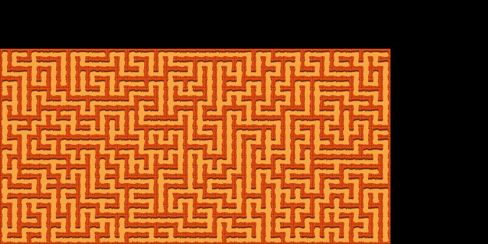

# MazeGenerator



This is a visualisation of a maze generation algorithm. The algorithm used is [randomised depth first search](https://en.wikipedia.org/wiki/Maze_generation_algorithm). This shows a mesmerising visualisation of how the algorithm "carves" a maze out of a grid.

## Installing

Follow these steps to install:
 1. Clone the repository to your PC.
 2. Double click on the ```GenProjects.bat``` batch file to run a script to generate ```.sln``` file for Visual Studio.
 3. Build the project.
 4. The executable will be found in ```bin/Release-windows-x64_x86``` or ```bin/Debug-windows-x64_x86```.

## Usage

### Basics

 - To launch, simply double click on the program or run ```MazeGenerator.exe``` in the command-line.
 - To exit, just hit the escape. Easy.
 - To view performance metrics, hit the F3 key.

### Controls

You will be greeted with a handful of controls when the program is launched.

 - Play: Starts generating the maze.
 - Reset: Presents you with a fresh blank maze.
 - Cell size: Represents the size of each cell in pixels. (Max: 64, Min: 8)
 - Speed: Allows you to alter the speed multiplier. This basically speeds up the generation.

## Dependencies

 - [raylib](https://www.raylib.com/)

## Future Plans

 - Allow the diagonals paths for the maze. In other words, 8 possible directions instead of 4.
 - Incorperate more than one maze generation algorithm.
 - Add feature to solve the maze after it's been generated.